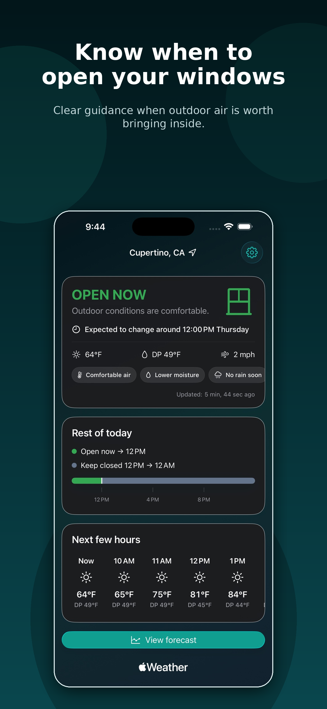
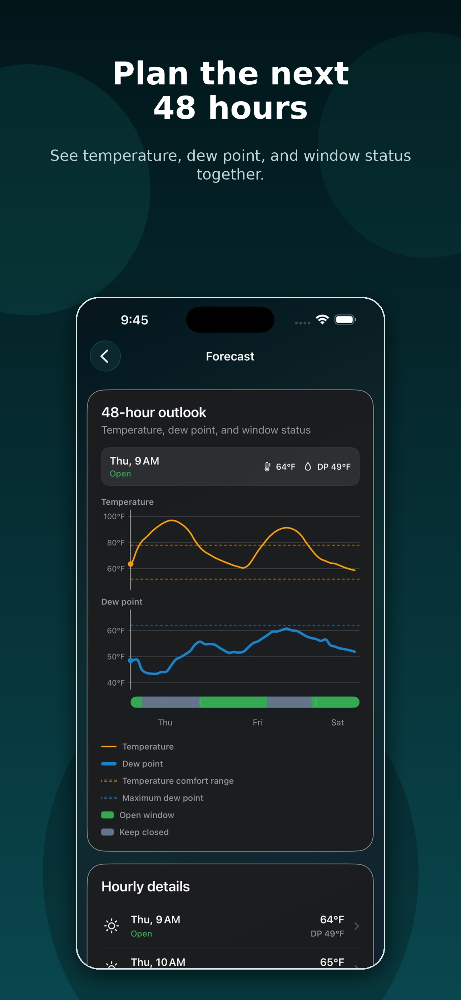
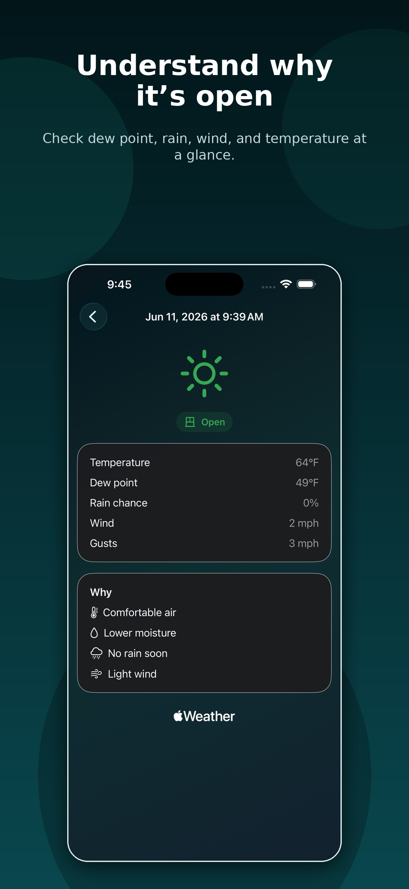
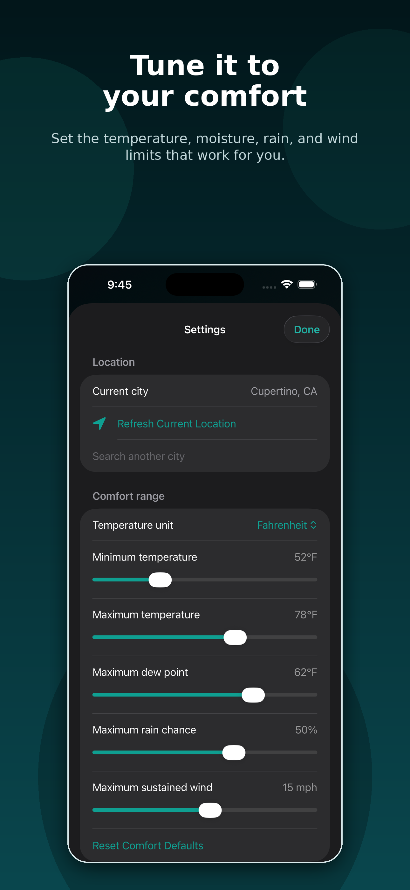

# OpenAir


**Know when to open your windows.**

OpenAir is an iOS 26 SwiftUI app that recommends when outdoor temperature, dew point, rain, and wind are suitable for opening windows.

<a href="https://apps.apple.com/us/app/openair-window-weather/id6777466080">
  
</a>

## Screenshots

<p>
  
  
  
  
</p>

## Features

- Window open/close recommendations based on outdoor conditions.
- Dew point aware comfort checks.
- Rain and wind safety checks.
- Local alerts when conditions change.
- Demo weather mode for unsigned simulator builds.

## Requirements

- Xcode 26
- iOS 26 simulator or device
- Apple Developer account with WeatherKit enabled
- Bundle ID: `com.openairapp.openair`

## Run

1. Open `OpenAir.xcodeproj`.
2. Select a development team for the `OpenAir` target.
3. Enable WeatherKit for the bundle ID `com.openairapp.openair` in the Apple Developer portal.
4. Build on an iOS 26 simulator or device.

Unsigned simulator builds can use **Use Demo Weather** when WeatherKit authentication is unavailable.

## Background Refresh Debugging

To manually trigger the `BGAppRefreshTask` handler while the app is running from Xcode, paste this into the LLDB console:

```lldb
(lldb) e -l objc -- (void)[[BGTaskScheduler sharedScheduler] _simulateLaunchForTaskWithIdentifier:@"com.openairapp.openair.refresh"]
```

This tests the registered background refresh handler only. It does not prove iOS will run background refresh on a predictable schedule.

## Recommendation Logic

OpenAir considers:

- Outdoor temperature
- Dew point
- Rain
- Wind speed
- Current window state

The recommendation engine is deterministic and covered by unit tests.

## Architecture

- `Domain`: weather models and the deterministic recommendation engine.
- `Services`: WeatherKit, Core Location, MapKit, notification, and cache adapters.
- `Features`: onboarding, dashboard, schedule, hour detail, and settings.
- `OpenAirTests`: recommendation boundaries, windows, notification transitions, persistence, and location fallback behavior.

## Contributing

Contributions are welcome.

Good first contributions include bug fixes, UI polish, accessibility improvements, documentation updates, and recommendation logic tests.

Before opening a large pull request, please start a GitHub issue to discuss the change.

## Privacy

OpenAir uses location to fetch local weather conditions. Alerts are local and best-effort. iOS can delay or skip background refreshes.
Weather and location data are used only for the app's window-opening recommendations.

## Support

[Leave a review on the App Store](https://apps.apple.com/app/id6777466080?action=write-review)

[openairappsupport@gmail.com](mailto:openairappsupport@gmail.com)
